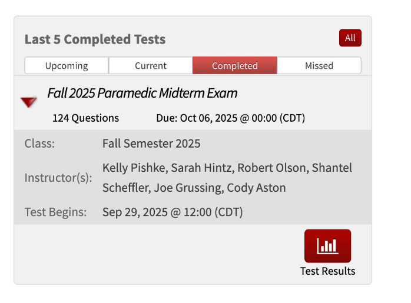

# EMSTrainer - Student Quick Start Guide


**Version:** 1.6.1  
**Date:** October 10, 2025  
**For:** EMS Students and Practitioners

---

## What is EMSTrainer?

EMSTrainer is an AI-powered training system that helps you:
- **Practice scenarios** with realistic patients and dynamic vitals
- **Test your knowledge** with targeted questions based on your weak areas
- **Study effectively** with AI-generated study guides focused on what you need

---

## Prerequisites

### Required:
- **GPT-5** enabled in Microsoft Copilot or ChatGPT
  - Go to settings and enable GPT-5 (required for medical accuracy)
  - **Tip:** Use **temporary chat mode** to avoid AI hallucinations and context drift during long scenarios
- Access to the EMSTrainer prompt files (from your instructor or repository)

### Helpful:
- Your most recent test results (PlatinumPlanner, practice exams, etc.)
- List of topics you're struggling with

---

## Uploading Your Test Results (Optional)

If you have test results from PlatinumPlanner, you can upload them to get personalized training focused on your weak areas.

### How to Download Test Results from PlatinumPlanner:

**Step 1:** Locate the completed **EMSTest** section in the lower-left column of the dashboard and click **"Test Results"**.



**Step 2:** Click **"Next Page"** twice to proceed to the final results page.


**Step 3:** Click on the **"National Registry ALS"** tab, then click the **"Export National Registry ALS Results"** button to download your test results.


**Step 4:** Save the file and upload it to EMSTrainer to receive personalized training content based on your weakest skill areas.

---

## Getting Started (3 Easy Steps)

### **Step 1: Load the Core Prompt**

1. Open Microsoft Copilot or ChatGPT
2. **Drag and drop** `prompts/EMSTrainer_Core.txt` into the chat
   - OR copy/paste the contents (file is 16k characters)
3. Wait for confirmation: `[Core loaded successfully]`

**That's it!** You now have access to Test and Study modes.

### **Step 2: Choose Your Mode**

#### **For Practice Questions:**
```
"I want to practice test questions. Here are my weak areas: 
Cardiology (65%), Respiratory (72%)"
```

The AI will generate targeted questions in those categories.

#### **For Study Help:**
```
"Create a study guide on cardiac rhythms"
```

or

```
"I don't understand ACLS. Can you help me study?"
```

#### **For Scenarios:**
You'll need to load an additional file first:
1. **Drag and drop** `prompts/EMSTrainer_Scenario_Mode.txt`
2. Then say: `"Run a cardiac arrest scenario in Standard mode"`

---

## Test Question Mode

### How It Works:

1. **Tell the AI your weak areas:**
   ```
   "I scored 65% on Cardiology and 70% on Respiratory on my last test"
   ```

2. **AI generates targeted questions:**
   - 70% focus on your weak areas
   - 20% on moderate areas
   - 10% on strong areas (maintenance)

3. **Answer the questions:**
   - Multiple choice, scenario-based, or true/false
   - Just type your answer: "A", "B", "C", or "D"

4. **Get immediate feedback:**
   - Correct/Incorrect
   - Explanation of why
   - Learning points
   - References to protocols

### Tips:
- Be honest about what you don't know
- Read explanations even when you're correct
- Track your progress: "Show my improvement in Cardiology"
- Request more questions: "Give me 5 more respiratory questions"

---

## Study Guide Mode

### How It Works:

1. **Request a study guide:**
   ```
   "Create a study guide on pediatric respiratory emergencies"
   ```

2. **AI generates focused content:**
   - Key concepts explained
   - Clinical applications
   - Common pitfalls
   - NREMT prep tips
   - Practice questions

3. **Ask follow-up questions:**
   ```
   "I don't understand why we use different oxygen delivery devices"
   ```
   ```
   "Can you explain croup vs epiglottitis?"
   ```

### Tips:
- Start broad, then go specific
- Request examples: "Give me a scenario showing this"
- Ask for mnemonics: "What's a memory trick for this?"
- Connect to what you know: "How does this relate to adult care?"

---

## Scenario Mode

### How It Works:

1. **Load Scenario Mode file:**
   - Drag and drop `prompts/EMSTrainer_Scenario_Mode.txt`

2. **Choose difficulty:**
   - **Easy:** Learning-focused, no penalties, lots of support
   - **Standard:** Realistic, balanced, NREMT-level
   - **Hard:** Challenging, strict timing, complex cases
   - **Monica:** EXTREME (only if you're feeling confident!)

3. **Request a scenario:**
   ```
   "Run a cardiac arrest scenario in Standard mode"
   ```
   or
   ```
   "Give me an Easy mode respiratory distress scenario"
   ```

4. **Interact naturally:**
   ```
   "I assess the airway - it's patent. I apply high-flow O2 via NRB"
   ```
   ```
   "Partner: Start an IV, 18 gauge, left AC"
   ```

5. **Get a comprehensive debrief:**
   - What you did well
   - What to improve
   - Timing analysis
   - Grading breakdown
   - NREMT prep tips

### Difficulty Guide:

**Easy Mode - Best for:**
- New students
- Learning new skills
- Building confidence
- Understanding the basics

**Standard Mode - Best for:**
- NREMT prep
- Realistic practice
- Most students most of the time
- Skill maintenance

**Hard Mode - Best for:**
- Experienced providers
- Pre-shift prep
- Challenge yourself
- Test day simulation

**Monica Mode - Best for:**
- Those who think they know everything
- Reality checks
- Proving yourself wrong
- Maximum stress testing
- ⚠️ **Not recommended for learners!**

---

## Tips for Success

### General:
1. **Be specific with your requests**
   - Good: "Cardiac arrest scenario, VF rhythm, Standard difficulty"
   - Less good: "Give me a scenario"

2. **Communicate clearly**
   - State your actions explicitly
   - Use closed-loop communication with your partner
   - Verbalize your thought process

3. **Learn from mistakes**
   - Read all explanations
   - Ask "Why?" when you don't understand
   - Request clarification: "Can you explain that differently?"

### For Scenarios:
1. **Always assess scene safety first** - even in Easy mode!
2. **Follow ABCs** - the AI notices if you skip steps
3. **Communicate with your partner** - give clear orders
4. **Think out loud** - helps you and helps the AI understand your reasoning
5. **Check the debrief** - that's where the real learning happens

### For Test Questions:
1. **Read the whole question** before answering
2. **Look for key words** - "immediate", "first", "most important"
3. **Review explanations** even when correct
4. **Track patterns** in what you're missing

### For Study Guides:
1. **Take notes** - don't just read
2. **Test yourself** - request practice questions on the material
3. **Apply it** - request scenarios using the concepts you just studied
4. **Connect concepts** - ask how topics relate

---

## Common Questions

**Q: Can I pause a scenario and come back later?**  
A: In the same chat session, yes. But it's best to complete scenarios in one sitting for realism. **Pro tip:** Start each scenario in a fresh temporary chat session to prevent AI hallucinations.

**Q: What is temporary chat mode?**  
A: In Copilot/ChatGPT, you can start a temporary/ephemeral chat that doesn't save history. This prevents the AI from "forgetting" instructions or making things up during long scenarios. It's especially helpful for Scenario Mode.

**Q: What if I disagree with the AI's answer?**  
A: Ask! Say "I think the answer should be X because..." - the AI will explain or correct itself.

**Q: How do I know if I'm ready for my test?**  
A: When you're consistently scoring 85%+ on Standard difficulty questions in your weak areas.

**Q: Can I create my own scenarios?**  
A: Yes! Just describe what you want: "Create a scenario about a diabetic emergency in an elderly patient"

**Q: What's the difference between modes?**  
A: Test = questions with explanations. Study = learning content. Scenario = interactive patient care.

**Q: Do I need both prompt files?**  
A: Core.txt alone gives you Test + Study. Add Scenario_Mode.txt for scenarios.

---

## Troubleshooting

**Problem: AI doesn't recognize a command**  
**Solution:** Make sure you loaded the Core.txt file. Try rephrasing your request.

**Problem: Scenario seems too easy/hard**  
**Solution:** Explicitly state difficulty: "Change to Hard mode" or "Switch to Easy mode"

**Problem: AI made a medical error**  
**Solution:** Point it out! The AI can make mistakes. Say "I think that's incorrect because..."

**Problem: Not sure what to do next**  
**Solution:** Just ask! "What should I do next?" or "What are my options?"

---

## Quick Reference Commands

```
"Generate 10 test questions on [topic]"
"Create a study guide for [topic]"
"Run a [type] scenario in [difficulty] mode"
"Show my progress"
"Switch to [Easy/Standard/Hard/Monica] mode"
"I need help with [concept]"
"Explain why [answer] is correct"
"Give me a harder question"
"Can you show me an example of this?"
```

---

## Getting Help

- Your instructor has access to more detailed documentation
- Check the examples folder for sample scenarios
- Review planning documents for upcoming features
- Report issues or suggestions to your instructor

---

## Ready to Start?

1. **Load Core.txt** into Copilot/ChatGPT
2. **Tell it your weak areas** or request a topic
3. **Start learning!**

Good luck with your studies! 🚑📚

---

*EMSTrainer v1.6.1 - Student Quick Start Guide*  
*Updated: October 10, 2025*
